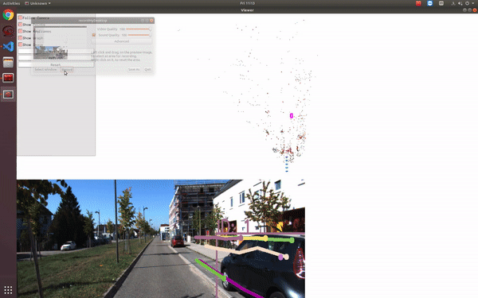

## about 

- this repo implements [OrcVIO](https://moshan.cf/orcvio_githubpage/) for KITTI dataset 

## dependencies 

- same dependencies as in [VO step](https://github.com/shanmo/kitti-vo-prediction)
- [pytorch models](https://github.com/moshanATucsd/orcvio_pytorch_models), put it in `orcvio-kitti-python/third_party`
- `conda install -c conda-forge filterpy`
- `conda install -c pytorch pytorch`, test with `'1.4.0'`
- `conda install -c anaconda pandas` 
- there is a yaml file for dependencies and can run `conda env create -f environment.yml` 

## demo 

- demo is for `odometry 06` 
- for first time run, set `load_detection_flag = False` since there are no saved detections 
- `python main.py`
- visualization 
> [video demo for odometry 06](https://youtu.be/763iztZBH0g)
 

## todo 

- [x] add camera pose update using object residual
- [ ] compare the camera poses with object update wrt without object update

## references 

- https://github.com/uoip/stereo_ptam
